# 可重入漏洞假阳性原因分析

>分析结果将作为：
>
> 1）实验数据集   
> 2）制定反模式（过滤规则）的依据

### 一、运行网页

项目用js写的，只有前端代码，由于涉及到跨域文件访问，所以不能用浏览器直接打开。

##### 方案一

下载WebStorm（用学生账号激活免费使用1年），用WebStorm打开本项目，点开arithmetic_fp_analyse.html，点击右上角用浏览器打开

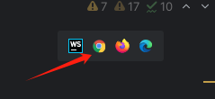

##### 方案二

用VSCode + 插件（具体什么插件需要网上搜，我还没用过）

### 二、假阳性原因分析

假阳性原因按照论文“Turn the Rudder: A Beacon of Reentrancy Detection for Smart Contracts on Ethereum”中所描述的，分为六类共8种

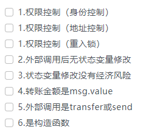

每种原因如果不太清楚，需要再仔细阅读论文，理解论文中给的例子。如果还有不明白的地方，随时和我讨论。

##### （1）开始分析

点击开始

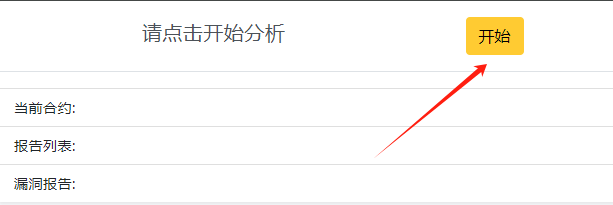

注意，智能合约和漏洞报告并非一对一的关系，有时候是一对多的关系，即一个智能合约可能有多个漏洞报告。
当存在多个漏洞报告时，需要对每个漏洞报告依次进行分析。

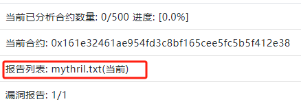

##### （2）确定漏洞报告中指出的源代码位置

两个文本编辑框，左边是智能合约的源码，右边是当前漏洞报告

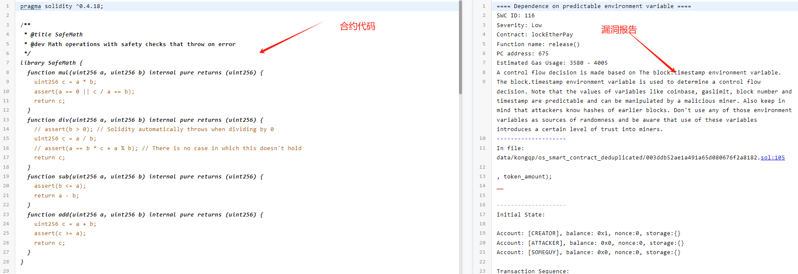

每个工具给出的漏洞报告格式都不一样，需要人工阅读分析漏洞报告对应源码的位置。一共有6种工具，以下举例每种报告的大致分析方法。

**mythril**

mythril的报告中，可重入漏洞对应的SWC ID是107，漏洞报告中指出了合约名称，函数名称，以及代码行，将这些信息依次填入分析结果中（合约名和函数名去掉括号，比如release()变成release）。

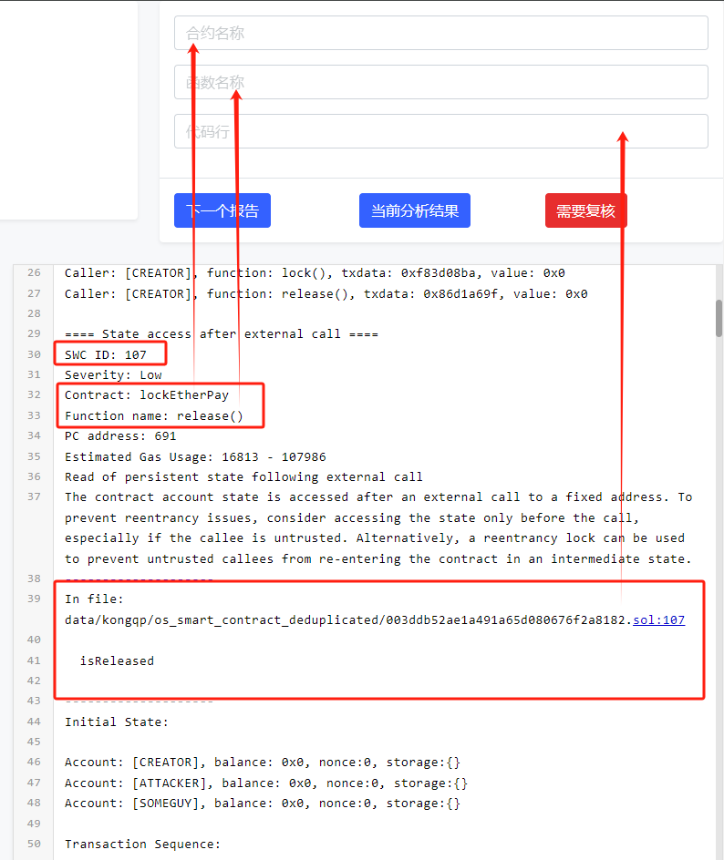

**sailfish**

sailfish的报告中，可重入漏洞类型叫“dao”，找到函数名，定位到合约中，在合约中找相应的外部调用（call.value或transfer或send函数），对假阳性原因进行分析。在此例中，外部调用是transfer，所以假阳性原因是【5.外部调用是transfer或send】

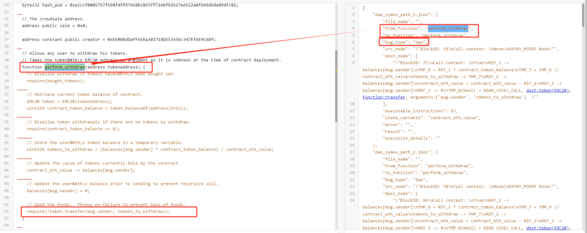

**securify2**

securify2的报告中，找到Pattern中含有Reentrancy的部分，确定合约名称和具体代码，将相关信息填写到分析结果中。对报告指出的语句进行分析。

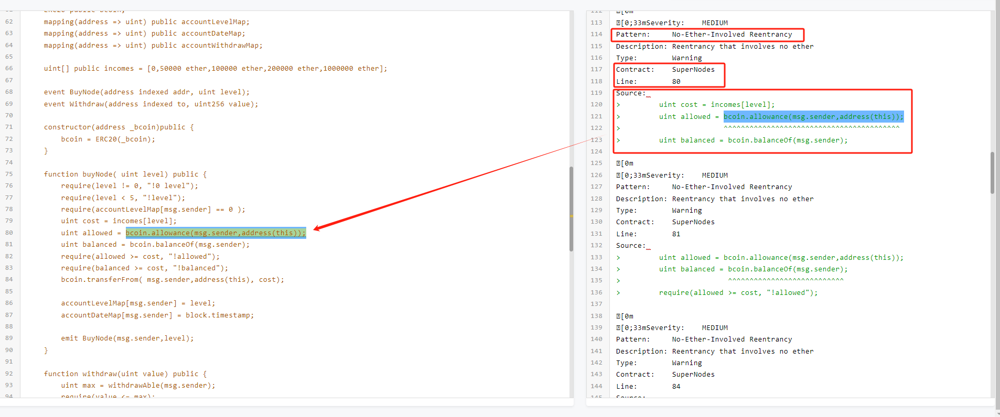

**securify1**

找到报告中“DAO”部分，根据其中指出的代码行定位到合约的指定位置。

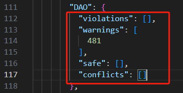

**oyente**

oyente报告如果 Re-Entrancy Vulnerability:的结果是True，向下找到Warning: Re-Entrancy Vulnerability.部分，定位到合约中的具体位置。

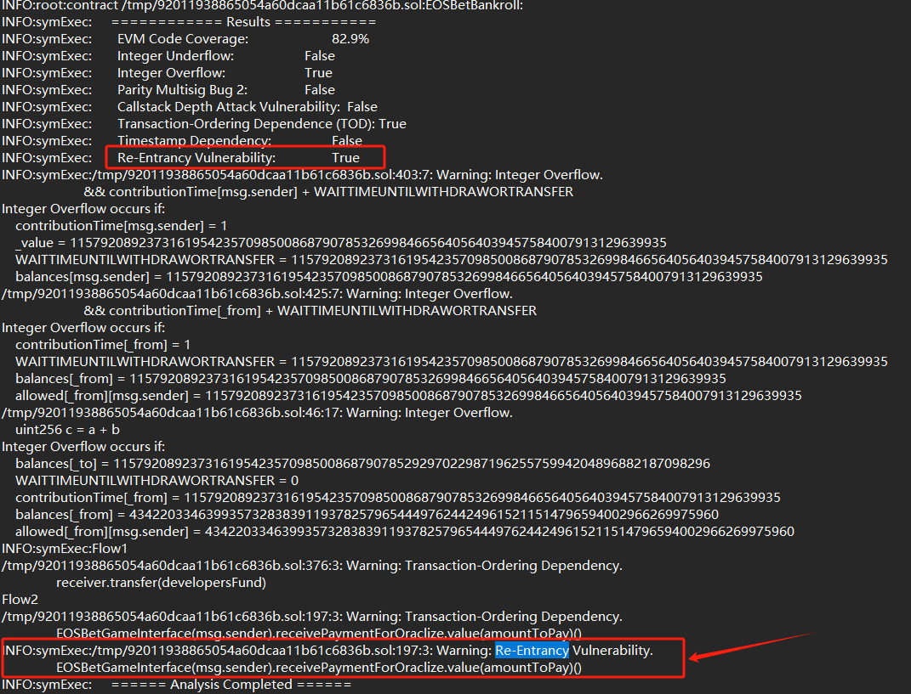

##### （3）给出假阳性原因

这里面有6类8种假阳性原因，是和论文“Turn the Rudder: A Beacon of Reentrancy Detection for Smart Contracts on Ethereum”中给出的假阳性原因一一对应的，如果有不懂的地方，读一下论文，或者与我讨论。

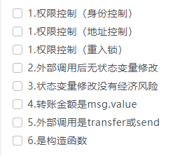

##### （4）下一个报告

依次填完四处分析结果后，点击下一个报告。如果当前的分析结果不确定，点击需要复核，然后再跳转下一个报告。

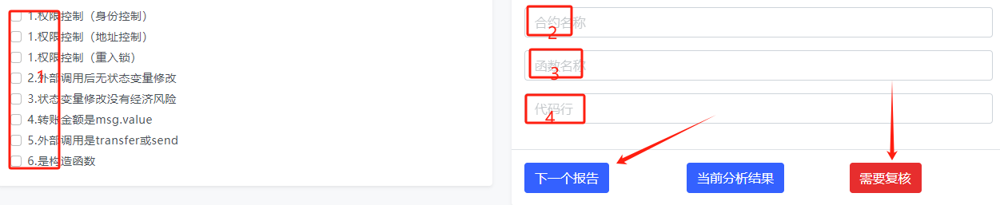

##### （5）保存分析结果

点击当前分析结果

可以从弹出的文本框复制json结果（麻烦）

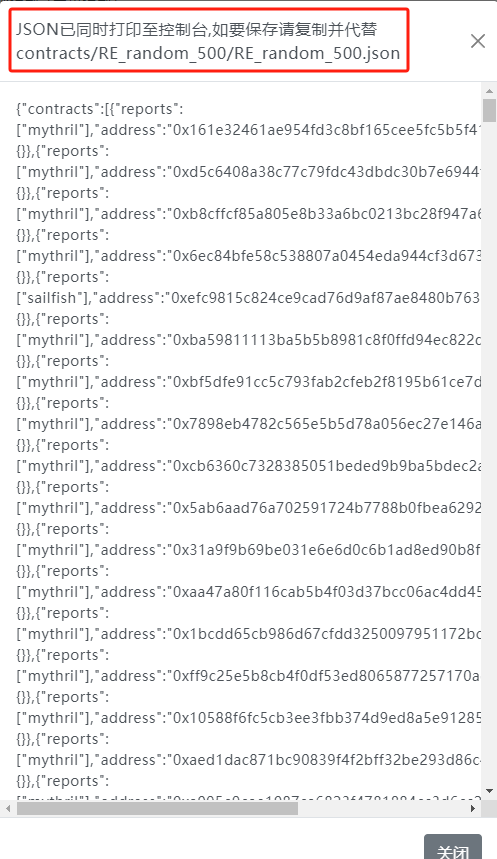

或者按F12，点击console（控制台），发现打印了一个object，右键复制这个object，并代替项目文件contracts/RE_random_500/RE_random_500.json中的内容

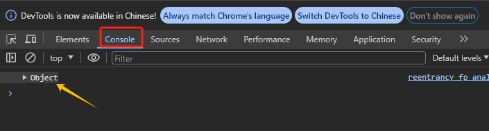

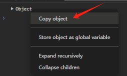

全选并粘贴

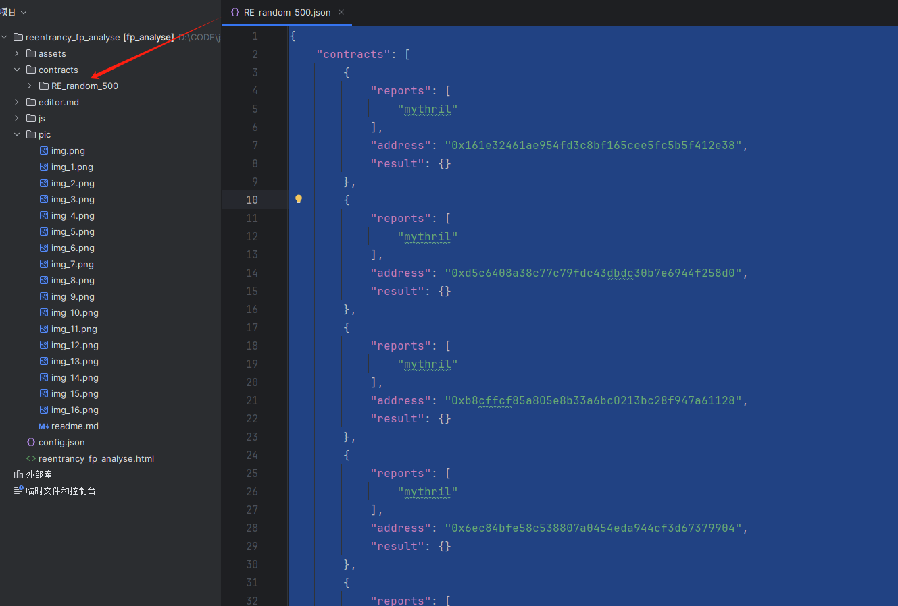

# 分析结果要经常备份，不要刷新页面否则会丢失进度
# 分析结果要经常备份，不要刷新页面否则会丢失进度
# 分析结果要经常备份，不要刷新页面否则会丢失进度